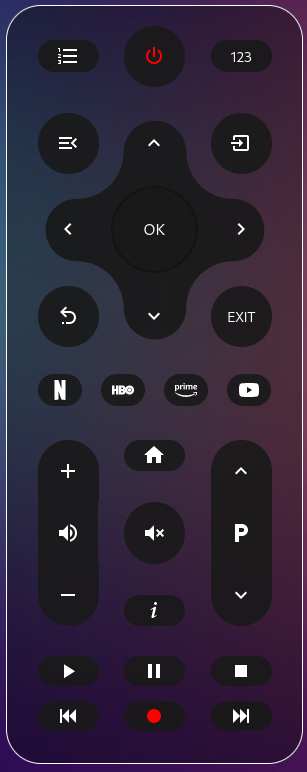
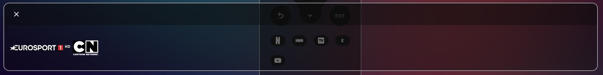

# Philips TV remote HACS
Philips TV remote card for home assistant 

[](https://hacs.xyz/docs/faq/custom_repositories/)

the project is based on the amazing work done by [madmicio](https://github.com/madmicio) in the [LG WebOS Remote](https://github.com/madmicio/LG-WebOS-Remote-Control) and basically adapted from it to work for Philips TVs


<p align="center">
  
  </br></br>
  
</p>

## Requirements

 `philips_js` integration: the remote and media player entites are are created by this integration (you can find it [here](https://www.home-assistant.io/integrations/philips_js/)) 

if you wanna use channels:
- `card-channel-pad` is required (you can find it [here](https://github.com/madmicio/channel-pad))

- `browser_mod` is required for this channel panel (you can find it [here](https://github.com/thomasloven/hass-browser_mod))


## Install

### HACS Card install

follow [custom repository](https://hacs.xyz/docs/faq/custom_repositories/) setup in HACS


### Manual install

1. Download and copy `philips-tv-remote.js` from (https://github.com/abualy/philips-tv-remote-hacs) into your custom components  directory.

2. Add a reference `philips-tv-remote.js` inside your resources config ( you can find it under https://HOME_ASSISTANT_URL/config/lovelace/resources ):

  ```yaml
  resources:
    - url: /local/"your_directory"/philips-tv-remote.js
      type: module
  ```
## Config
### Lovelace config: basic config

```yaml
- type: "custom:philips-tv-remote"
  remote: remote.philips_tv_remote
  entity: media_player.philips_tv
```

the remote and media player entites are required and are created by the [philips_js](https://www.home-assistant.io/integrations/philips_js/) integration 

### Main Options

| Name | Type | Default | Supported options | Description |
| -------------- | ----------- | ------------ | ------------------------------------------------ | --------------------------------------------------------------------------------------------------------------------------------------------------------------------------------------------------------------------------------------------------------------------------------------------------------------------------------------------- |
| `type` | string | **Required** | `custom:philips-tv-remote` | Type of the card |
| `entity` | string | **Required** |  | tv media_player entity |
| `remote` | string | **Required** |  | tv emote entity, added by the [philips_js](https://www.home-assistant.io/integrations/philips_js/) integration |
| `name` | string | **Option** |  | tv name |
| `colors` | string | **Option** |  | list of color options |
| `channels` |  | **Option**|  | list of channel in popup |
| `sources` |  | **Option**|  | list of custom app. if not set, default apps will be displayed |
| `color_buttons` |  | **Option**| enable | display color buttons: RED GREEN YELLOW BLUE |

### Source Options

| Name | Type | Default | Supported options | Description |
| -------------- | ----------- | ------------ | ------------------------------------------------ | --------------------------------------------------------------------------------------------------------------------------------------------------------------------------------------------------------------------------------------------------------------------------------------------------------------------------------------------- |
| `icon` | string | **Required** | "mdi:netflix"| url of the image to be displayed in the channel pad popup |
| `url` | string | **Required** | app url | you have to write the exact url of the app to launch. you can find the correct url in the state of your media_player entity under "media_content_id" |

```yaml
sources:
  - icon: "mdi:netflix"
    url: "com.netflix.ninja.MainActivity-com.netflix.ninja"
  - icon: "si:hbo"
    url: "com.hbo.max.HboMaxActivity-com.hbo.hbonow"
  - icon: "si:prime"
    url: "com.amazon.ignition.IgnitionActivity-com.amazon.amazonvideo"
  - icon: "mdi:youtube"
    url: "com.google.android.apps.youtube.tv.activity.ShellActivity-com.google.android.youtube.tv"
```

### Channels Options

| Name | Type | Default | Supported options | Description |
| -------------- | ----------- | ------------ | ------------------------------------------------ | --------------------------------------------------------------------------------------------------------------------------------------------------------------------------------------------------------------------------------------------------------------------------------------------------------------------------------------------- |
| `image` | url | **Required** | /local/your_dir/tv_logo/your_image.png | url of the image to be displayed in the channel pad popup |
| `number` | string | **Required** | number | TV channel number |

```yaml
channels:
  - image: /local/tv_logo/EuroSportHD.png
    number: "501"
  - image: /local/tv_logo/CartoonNetwork.png
    number: "502"
```

**NB**: `channels` configuration is not mandatory. if `channels` is not configured the remote control will work normally but you will not be able to use the channel pad.

### Colors Options

| Name | Type | Default | Supported options | Description |
| -------------- | ----------- | ------------ | ------------------------------------------------ | --------------------------------------------------------------------------------------------------------------------------------------------------------------------------------------------------------------------------------------------------------------------------------------------------------------------------------------------- |
| `buttons` | string | **Option** | color formats | buttons background-color |
| `texts` | string | **Option** | color formats | number and icon color |
| `background:` | string | **Option** | color formats | list of color options |
| `border:` | string | --app-header-text-color | color formats | remote border color |

```yaml
colors:
  buttons: var(--deactive-background-button-color)
  texts: pink
  background: rgba(95,155,234)
```

### Dimensions Options

| Name | Type | Default | Supported options | Description |
| -------------- | ----------- | ------------ | ------------------------------------------------ | --------------------------------------------------------------------------------------------------------------------------------------------------------------------------------------------------------------------------------------------------------------------------------------------------------------------------------------------- |
| `scale` |  | **Option**| number | scale factor; default 1 |
| `border_width` |  | **Option**| number | set remote border width; default 1px |

  
  the remote control supports the scale option to adjust its size

```yaml
dimensions:
  scale: 0.98
  border_width: 3px
```

### lovelace config: full config

```yaml
- type: "custom:philips-tv-remote"
  name: Philips TV
  entity: media_player.philips_tv
  remote: remote.philips_tv
  sources:
    - icon: "mdi:netflix"
      url: "com.netflix.ninja.MainActivity-com.netflix.ninja"
    - icon: "si:hbo"
      url: "com.hbo.max.HboMaxActivity-com.hbo.hbonow"
    - icon: "si:prime"
      url: com.amazon.ignition.IgnitionActivity-com.amazon.amazonvideo
    - icon: "mdi:youtube"
      url: "com.google.android.apps.youtube.tv.activity.ShellActivity-com.google.android.youtube.tv"
  channels:
    - image: /local/images/tv_logo/channel_1.png
      number: "1"
    - image: /local/images/tv_logo/channel_2.png
      number: "1"
  color_buttons: enable
  dimensions:
    scale: 0.98
    border_width: 3px
  colors:
    buttons: var(--deactive-background-button-color)
    texts: pink
    background: rgba(95,155,234)
```
